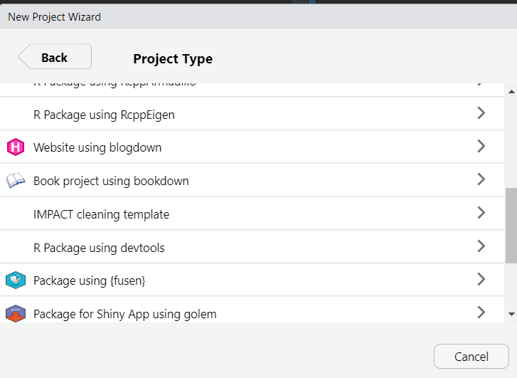

## cleaningtools

<!-- badges: start -->

[](code_of_conduct.md)
[](https://github.com/impact-initiatives/cleaningtools/actions/workflows/R-CMD-check.yaml)
[](https://codecov.io/gh/impact-initiatives/cleaningtools)

<!-- badges: end -->

## Overview

The `cleaningtools` package focuses on cleaning, and has three
components:
<p>

**1. Check**, which includes a set of functions that flag values, such
as check_outliers and check_logical. <br> **2. Create**, which includes
a set of functions to create different items for use in cleaning, such
as the cleaning log from the checks, clean data, and enumerator
performance. <br> **3. Review**, which includes a set of functions to
review the cleaning, such as reviewing the cleaning.

## Installation

You can install the development version from
[GitHub](https://github.com/) with:

``` r
# install.packages("devtools")
devtools::install_github("impact-initiatives/cleaningtools")
```

## Template

You can use the R studio wizard to create project template.



## Examples

### 1. Checks on the dataset

#### 1.1 Check of PII

`check_pii()` function takes raw data (input can be dataframe or list.
However incase of list, you must specify the element name in
`element_name` parameter!) and looks for potential PII in the dataset.
By default, the function will look for following words but you can also
add additional words to look by using `words_to_look` parameter.The
default words
are-`c("telephone","contact","name","gps","neighbourhood","latitude","logitude","contact","nom","gps","voisinage")`.
The function will give a list with two element. One will be the data and
second one will be the list of potential PII

- Using dataframe as input

``` r
output_from_data <- cleaningtools::check_pii(dataset = cleaningtools::cleaningtools_raw_data, words_to_look = "date", uuid_column = "X_uuid")
output_from_data$potential_PII |> head()
#> # A tibble: 6 × 3
#>   uuid  question                              issue        
#>   <chr> <chr>                                 <chr>        
#> 1 all   date_assessment                       Potential PII
#> 2 all   neighbourhood                         Potential PII
#> 3 all   return_date                           Potential PII
#> 4 all   water_supply_rest_neighbourhood       Potential PII
#> 5 all   water_supply_other_neighbourhoods     Potential PII
#> 6 all   water_supply_other_neighbourhoods_why Potential PII
```

- Using list as input

``` r
### from list
df_list <- list(raw_data = cleaningtools::cleaningtools_raw_data)
output_from_list <- cleaningtools::check_pii(dataset = df_list, element_name = "raw_data", words_to_look = "date", uuid_column = "X_uuid")
output_from_list$potential_PII |> head()
#> # A tibble: 6 × 3
#>   uuid  question                              issue        
#>   <chr> <chr>                                 <chr>        
#> 1 all   date_assessment                       Potential PII
#> 2 all   neighbourhood                         Potential PII
#> 3 all   return_date                           Potential PII
#> 4 all   water_supply_rest_neighbourhood       Potential PII
#> 5 all   water_supply_other_neighbourhoods     Potential PII
#> 6 all   water_supply_other_neighbourhoods_why Potential PII
```

#### 1.2 Check of duration from audits

##### 1.2.1 Reading the audits files

It will read only the compressed file.

``` r
my_audit_list <- cleaningtools::create_audit_list(audit_zip_path = "audit_for_tests_100.zip")
```

##### 1.2.2 Adding the duration to the dataset

Once you have read your audit file from the zip, you will get a list of
audit. You can use this list to calculate and add the duration. You have
2 options with a start and end question or summing all the durations.

``` r
list_audit <- list(
  uuid1 = data.frame(
    event = c("form start", rep("question", 5)),
    node = c("", paste0("/xx/question", 1:5)),
    start = c(
      1661415887295, 1661415887301,
      1661415890819, 1661415892297,
      1661415893529, 1661415894720
    ),
    end = c(
      NA, 1661415890790, 1661415892273,
      1661415893506, 1661415894703,
      1661415896452
    )
  ),
  uuid2 = data.frame(
    event = c("form start", rep("question", 5)),
    node = c("", paste0("/xx/question", 1:5)),
    start = c(1661415887295, 1661415887301, 1661415890819, 1661415892297, 1661415893529, 1661415894720),
    end = c(NA, 1661415890790, 1661415892273, 1661415893506, 1661415894703, 1661415896452)
  )
)
some_dataset <- data.frame(
  X_uuid = c("uuid1", "uuid2"),
  question1 = c("a", "b"),
  question2 = c("a", "b"),
  question3 = c("a", "b"),
  question4 = c("a", "b"),
  question5 = c("a", "b")
)
```

If you want to sum all the duration.

``` r
cleaningtools::add_duration_from_audit(some_dataset, uuid_column = "X_uuid", audit_list = list_audit)
#>   X_uuid question1 question2 question3 question4 question5
#> 1  uuid1         a         a         a         a         a
#> 2  uuid2         b         b         b         b         b
#>   duration_audit_sum_all_ms duration_audit_sum_all_minutes
#> 1                      9058                            0.2
#> 2                      9058                            0.2
```

If you want to use calculate duration between 2 questions.

``` r
cleaningtools::add_duration_from_audit(some_dataset,
  uuid_column = "X_uuid", audit_list = list_audit,
  start_question = "question1",
  end_question = "question3",
  sum_all = F
)
#>   X_uuid question1 question2 question3 question4 question5
#> 1  uuid1         a         a         a         a         a
#> 2  uuid2         b         b         b         b         b
#>   duration_audit_start_end_ms duration_audit_start_end_minutes
#> 1                        6205                              0.1
#> 2                        6205                              0.1
```

If you want to do both.

``` r
cleaningtools::add_duration_from_audit(some_dataset,
  uuid_column = "X_uuid", audit_list = list_audit,
  start_question = "question1",
  end_question = "question3",
  sum_all = T
)
#>   X_uuid question1 question2 question3 question4 question5
#> 1  uuid1         a         a         a         a         a
#> 2  uuid2         b         b         b         b         b
#>   duration_audit_sum_all_ms duration_audit_sum_all_minutes
#> 1                      9058                            0.2
#> 2                      9058                            0.2
#>   duration_audit_start_end_ms duration_audit_start_end_minutes
#> 1                        6205                              0.1
#> 2                        6205                              0.1
```

##### 1.2.3 checking the duration of the dataset

Once you have added the duration to the dataset, you can check if
duration are between the threshold you are looking for.

``` r
testdata <- data.frame(
  uuid = c(letters[1:7]),
  duration_audit_start_end_ms = c(
    2475353, 375491, 2654267, 311585, 817270,
    2789505, 8642007
  ),
  duration_audit_start_end_minutes = c(41, 6, 44, 5, 14, 46, 144)
)

cleaningtools::check_duration(testdata, column_to_check = "duration_audit_start_end_minutes") |> head()
#> $checked_dataset
#>   uuid duration_audit_start_end_ms duration_audit_start_end_minutes
#> 1    a                     2475353                               41
#> 2    b                      375491                                6
#> 3    c                     2654267                               44
#> 4    d                      311585                                5
#> 5    e                      817270                               14
#> 6    f                     2789505                               46
#> 7    g                     8642007                              144
#> 
#> $duration_log
#>   uuid old_value                         question
#> 1    b         6 duration_audit_start_end_minutes
#> 2    d         5 duration_audit_start_end_minutes
#> 3    e        14 duration_audit_start_end_minutes
#> 4    g       144 duration_audit_start_end_minutes
#>                                             issue
#> 1 Duration is lower or higher than the thresholds
#> 2 Duration is lower or higher than the thresholds
#> 3 Duration is lower or higher than the thresholds
#> 4 Duration is lower or higher than the thresholds

cleaningtools::check_duration(
  testdata,
  column_to_check = "duration_audit_start_end_ms",
  lower_bound = 375490,
  higher_bound = 8642000
) |> head()
#> $checked_dataset
#>   uuid duration_audit_start_end_ms duration_audit_start_end_minutes
#> 1    a                     2475353                               41
#> 2    b                      375491                                6
#> 3    c                     2654267                               44
#> 4    d                      311585                                5
#> 5    e                      817270                               14
#> 6    f                     2789505                               46
#> 7    g                     8642007                              144
#> 
#> $duration_log
#>   uuid old_value                    question
#> 1    d    311585 duration_audit_start_end_ms
#> 2    g   8642007 duration_audit_start_end_ms
#>                                             issue
#> 1 Duration is lower or higher than the thresholds
#> 2 Duration is lower or higher than the thresholds

testdata %>%
  cleaningtools::check_duration(column_to_check = "duration_audit_start_end_minutes") %>%
  check_duration(
    column_to_check = "duration_audit_start_end_ms",
    log_name = "duration_in_ms",
    lower_bound = 375490,
    higher_bound = 8642000
  ) |>
  head()
#> $checked_dataset
#>   uuid duration_audit_start_end_ms duration_audit_start_end_minutes
#> 1    a                     2475353                               41
#> 2    b                      375491                                6
#> 3    c                     2654267                               44
#> 4    d                      311585                                5
#> 5    e                      817270                               14
#> 6    f                     2789505                               46
#> 7    g                     8642007                              144
#> 
#> $duration_log
#>   uuid old_value                         question
#> 1    b         6 duration_audit_start_end_minutes
#> 2    d         5 duration_audit_start_end_minutes
#> 3    e        14 duration_audit_start_end_minutes
#> 4    g       144 duration_audit_start_end_minutes
#>                                             issue
#> 1 Duration is lower or higher than the thresholds
#> 2 Duration is lower or higher than the thresholds
#> 3 Duration is lower or higher than the thresholds
#> 4 Duration is lower or higher than the thresholds
#> 
#> $duration_in_ms
#>   uuid old_value                    question
#> 1    d    311585 duration_audit_start_end_ms
#> 2    g   8642007 duration_audit_start_end_ms
#>                                             issue
#> 1 Duration is lower or higher than the thresholds
#> 2 Duration is lower or higher than the thresholds
```

#### 1.3 Check outliers

`check_outliers()` takes raw data set and look for potential outlines.
It can both data frame or list. However you must specify the element
name (name of your data set in the given list) in `element_name`
parameter!

``` r
set.seed(122)
### from list
df_outlier <- data.frame(
  uuid = paste0("uuid_", 1:100),
  one_value = c(round(runif(90, min = 45, max = 55)), round(runif(5)), round(runif(5, 99, 100))),
  expense = c(sample(200:500, replace = T, size = 95), c(600, 100, 80, 1020, 1050)),
  income = c(c(60, 0, 80, 1020, 1050), sample(20000:50000, replace = T, size = 95)),
  yy = c(rep(100, 99), 10)
)
outliers <- cleaningtools::check_outliers(dataset = df_outlier, uuid_column = "uuid")
#> [1] "checking_one_value"
#> [1] "checking_expense"
#> [1] "checking_income"
#> [1] "checking_yy"
outliers$potential_outliers |> head()
#> # A tibble: 6 × 4
#>   uuid    issue                         question  old_value
#>   <chr>   <chr>                         <chr>         <dbl>
#> 1 uuid_91 outlier (normal distribution) one_value         1
#> 2 uuid_92 outlier (normal distribution) one_value         0
#> 3 uuid_93 outlier (normal distribution) one_value         0
#> 4 uuid_94 outlier (normal distribution) one_value         0
#> 5 uuid_95 outlier (normal distribution) one_value         0
#> 6 uuid_96 outlier (normal distribution) one_value       100
```

#### 1.4 Check for value

`check_value()` function look for specified value in the given data set
and return in a cleaning log format. The function can take a data frame
or a list as input.

``` r
set.seed(122)

df <- data.frame(
  X_uuid = paste0("uuid_", 1:100),
  age = c(sample(18:80, replace = T, size = 96), 99, 99, 98, 88),
  gender = c("99", sample(c("male", "female"), replace = T, size = 95), "98", "98", "88", "888")
)

output <- cleaningtools::check_value(dataset = df, uuid_column = "X_uuid", element_name = "checked_dataset", values_to_look = c(99, 98, 88, 888))

output$flaged_value |> head()
#> # A tibble: 6 × 4
#>   uuid    question old_value issue                             
#>   <chr>   <chr>    <chr>     <chr>                             
#> 1 uuid_1  gender   99        Possible value to be changed to NA
#> 2 uuid_97 age      99        Possible value to be changed to NA
#> 3 uuid_97 gender   98        Possible value to be changed to NA
#> 4 uuid_98 age      99        Possible value to be changed to NA
#> 5 uuid_98 gender   98        Possible value to be changed to NA
#> 6 uuid_99 age      98        Possible value to be changed to NA
```

#### 1.5 Check logics

`check_logical()` takes a regular expression, as it is how it will be
read from Excel `check_logical_with_list()`.

``` r
test_data <- data.frame(
  uuid = c(1:10) %>% as.character(),
  today = rep("2023-01-01", 10),
  location = rep(c("villageA", "villageB"), 5),
  distance_to_market = c(rep("less_30", 5), rep("more_30", 5)),
  access_to_market = c(rep("yes", 4), rep("no", 6)),
  number_children_05 = c(rep(c(0, 1), 4), 5, 6)
)
cleaningtools::check_logical(test_data,
  uuid_column = "uuid",
  check_to_perform = "distance_to_market == \"less_30\" & access_to_market == \"no\"",
  columns_to_clean = "distance_to_market, access_to_market",
  description = "distance to market less than 30 and no access"
) |> head()
#> $checked_dataset
#>    uuid      today location distance_to_market access_to_market
#> 1     1 2023-01-01 villageA            less_30              yes
#> 2     2 2023-01-01 villageB            less_30              yes
#> 3     3 2023-01-01 villageA            less_30              yes
#> 4     4 2023-01-01 villageB            less_30              yes
#> 5     5 2023-01-01 villageA            less_30               no
#> 6     6 2023-01-01 villageB            more_30               no
#> 7     7 2023-01-01 villageA            more_30               no
#> 8     8 2023-01-01 villageB            more_30               no
#> 9     9 2023-01-01 villageA            more_30               no
#> 10   10 2023-01-01 villageB            more_30               no
#>    number_children_05 logical_xx
#> 1                   0      FALSE
#> 2                   1      FALSE
#> 3                   0      FALSE
#> 4                   1      FALSE
#> 5                   0       TRUE
#> 6                   1      FALSE
#> 7                   0      FALSE
#> 8                   1      FALSE
#> 9                   5      FALSE
#> 10                  6      FALSE
#> 
#> $logical_xx
#> # A tibble: 2 × 6
#>   uuid  question           old_value issue                check_id check_binding
#>   <chr> <chr>              <chr>     <chr>                <chr>    <chr>        
#> 1 5     distance_to_market less_30   distance to market … logical… logical_xx ~…
#> 2 5     access_to_market   no        distance to market … logical… logical_xx ~…
```

``` r
test_data <- data.frame(
  uuid = c(1:10) %>% as.character(),
  distance_to_market = rep(c("less_30", "more_30"), 5),
  access_to_market = c(rep("yes", 4), rep("no", 6)),
  number_children_05 = c(rep(c(0, 1), 4), 5, 6),
  number_children_618 = c(rep(c(0, 1), 4), 5, 6)
)

check_list <- data.frame(
  name = c("logical_xx", "logical_yy", "logical_zz"),
  check = c(
    "distance_to_market == \"less_30\" & access_to_market == \"no\"",
    "number_children_05 > 3",
    "rowSums(dplyr::across(starts_with(\"number\")), na.rm = T) > 9"
  ),
  description = c(
    "distance to market less than 30 and no access",
    "number of children under 5 seems high",
    "number of children very high"
  ),
  variables_to_clean = c(
    "distance_to_market, access_to_market",
    "number_children_05",
    ""
  )
)
cleaningtools::check_logical_with_list(test_data,
  uuid_column = "uuid",
  list_of_check = check_list,
  check_id_column = "name",
  check_to_perform_column = "check",
  columns_to_clean_column = "variables_to_clean",
  description_column = "description"
) |> head()
#> Warning in check_logical(dataset = dataset, uuid_column = uuid_column,
#> information_to_add = information_to_add, : columns_to_clean not shared, results
#> may not be accurate
#> $checked_dataset
#>    uuid distance_to_market access_to_market number_children_05
#> 1     1            less_30              yes                  0
#> 2     2            more_30              yes                  1
#> 3     3            less_30              yes                  0
#> 4     4            more_30              yes                  1
#> 5     5            less_30               no                  0
#> 6     6            more_30               no                  1
#> 7     7            less_30               no                  0
#> 8     8            more_30               no                  1
#> 9     9            less_30               no                  5
#> 10   10            more_30               no                  6
#>    number_children_618 logical_xx logical_yy logical_zz
#> 1                    0      FALSE      FALSE      FALSE
#> 2                    1      FALSE      FALSE      FALSE
#> 3                    0      FALSE      FALSE      FALSE
#> 4                    1      FALSE      FALSE      FALSE
#> 5                    0       TRUE      FALSE      FALSE
#> 6                    1      FALSE      FALSE      FALSE
#> 7                    0       TRUE      FALSE      FALSE
#> 8                    1      FALSE      FALSE      FALSE
#> 9                    5       TRUE       TRUE       TRUE
#> 10                   6      FALSE       TRUE       TRUE
#> 
#> $logical_all
#> # A tibble: 10 × 6
#>    uuid  question           old_value               issue check_id check_binding
#>    <chr> <chr>              <chr>                   <chr> <chr>    <chr>        
#>  1 5     distance_to_market less_30                 dist… logical… logical_xx ~…
#>  2 5     access_to_market   no                      dist… logical… logical_xx ~…
#>  3 7     distance_to_market less_30                 dist… logical… logical_xx ~…
#>  4 7     access_to_market   no                      dist… logical… logical_xx ~…
#>  5 9     distance_to_market less_30                 dist… logical… logical_xx ~…
#>  6 9     access_to_market   no                      dist… logical… logical_xx ~…
#>  7 9     number_children_05 5                       numb… logical… logical_yy ~…
#>  8 10    number_children_05 6                       numb… logical… logical_yy ~…
#>  9 9     unable to identify please check this uuid… numb… logical… logical_zz ~…
#> 10 10    unable to identify please check this uuid… numb… logical… logical_zz ~…
```

#### 1.6 Check for duplicates

##### 1.6.1 With one or several variables

``` r
testdata <- data.frame(
  uuid = c(letters[1:4], "a", "b", "c"),
  col_a = runif(7),
  col_b = runif(7)
)
cleaningtools::check_duplicate(testdata)
#> $checked_dataset
#>   uuid     col_a     col_b
#> 1    a 0.9166284 0.2958878
#> 2    b 0.3212423 0.6047783
#> 3    c 0.2052720 0.8932896
#> 4    d 0.1512732 0.1883179
#> 5    a 0.8096267 0.3822435
#> 6    b 0.5861553 0.6640918
#> 7    c 0.9902022 0.7932066
#> 
#> $duplicate_log
#>   uuid old_value question           issue
#> 1    a         a     uuid duplicated uuid
#> 2    b         b     uuid duplicated uuid
#> 3    c         c     uuid duplicated uuid
```

Or you can check duplicate for a specific variable or combination of
variables.

``` r
testdata2 <- data.frame(
  uuid = letters[c(1:7)],
  village = paste("village", c(1:3, 1:3, 4)),
  ki_identifier = paste0("xx_", c(1:5, 3, 4))
)
check_duplicate(testdata2, columns_to_check = "village")
#> $checked_dataset
#>   uuid   village ki_identifier
#> 1    a village 1          xx_1
#> 2    b village 2          xx_2
#> 3    c village 3          xx_3
#> 4    d village 1          xx_4
#> 5    e village 2          xx_5
#> 6    f village 3          xx_3
#> 7    g village 4          xx_4
#> 
#> $duplicate_log
#> # A tibble: 3 × 4
#>   uuid  question old_value issue             
#>   <chr> <chr>    <chr>     <glue>            
#> 1 d     village  village 1 duplicated village
#> 2 e     village  village 2 duplicated village
#> 3 f     village  village 3 duplicated village
check_duplicate(testdata2, columns_to_check = c("village", "ki_identifier"))
#> $checked_dataset
#>   uuid   village ki_identifier
#> 1    a village 1          xx_1
#> 2    b village 2          xx_2
#> 3    c village 3          xx_3
#> 4    d village 1          xx_4
#> 5    e village 2          xx_5
#> 6    f village 3          xx_3
#> 7    g village 4          xx_4
#> 
#> $duplicate_log
#> # A tibble: 2 × 4
#>   uuid  question      old_value issue                               
#>   <chr> <chr>         <chr>     <glue>                              
#> 1 f     village       village 3 duplicated village ~/~ ki_identifier
#> 2 f     ki_identifier xx_3      duplicated village ~/~ ki_identifier
```

##### 1.6.2 With the gower distance (soft duplicates)

To use it with the complete dataset:

``` r
soft_duplicates <- check_soft_duplicates(
  dataset = cleaningtools_raw_data,
  kobo_survey = cleaningtools_survey,
  uuid_column = "X_uuid",
  idnk_value = "dont_know",
  sm_separator = ".",
  log_name = "soft_duplicate_log",
  threshold = 7
)

soft_duplicates[["soft_duplicate_log"]] %>% head()
#> [1] uuid  issue
#> <0 rows> (or 0-length row.names)

soft_duplicates <- check_soft_duplicates(
  dataset = cleaningtools_raw_data,
  kobo_survey = cleaningtools_survey,
  uuid_column = "X_uuid",
  idnk_value = "dont_know",
  sm_separator = ".",
  log_name = "soft_duplicate_log",
  threshold = 7, 
  return_all_results = TRUE
)

soft_duplicates[["soft_duplicate_log"]] %>% head()
#>                                   uuid num_cols_not_NA total_columns_compared
#> 1 3370f726-395a-4675-94fe-9e745e0b36e9              75                    148
#> 2 93095da3-5291-4d16-a19a-41bf13144bfe              85                    148
#> 3 db5e05db-94e9-44aa-9206-3e1c17a7a233              85                    148
#> 4 dc7bf25b-e18b-4b9e-bb34-5d7a1e762eb2              75                    148
#> 5 0858486a-1d3d-492b-863f-b050cb9fe7af              74                    148
#> 6 193d5f36-93b9-4c97-9205-13aa7e3a6c7f              75                    148
#>   num_cols_dont_know               id_most_similar_survey
#> 1                  0 dc7bf25b-e18b-4b9e-bb34-5d7a1e762eb2
#> 2                  0 db5e05db-94e9-44aa-9206-3e1c17a7a233
#> 3                  0 93095da3-5291-4d16-a19a-41bf13144bfe
#> 4                  0 3370f726-395a-4675-94fe-9e745e0b36e9
#> 5                  0 93893e39-9c82-4e19-b480-4dc78033157b
#> 6                  0 ac42b381-4d3b-42b4-96fb-676d43a8c4e7
#>   number_different_columns issue
#> 1                        9  <NA>
#> 2                        9  <NA>
#> 3                        9  <NA>
#> 4                        9  <NA>
#> 5                       10  <NA>
#> 6                       10  <NA>
```

To use it grouping by enumerator:

``` r
group_by_enum_raw_data <- cleaningtools_raw_data %>%
  dplyr::group_by(enumerator_num)
soft_per_enum <- group_by_enum_raw_data %>%
  dplyr::group_split() %>%
  purrr::map(~ check_soft_duplicates(
    dataset = .,
    kobo_survey = cleaningtools_survey,
    uuid_column = "X_uuid", idnk_value = "dont_know",
    sm_separator = ".",
    log_name = "soft_duplicate_log",
    threshold = 7, 
    return_all_results = TRUE
  ))
soft_per_enum %>%
  purrr::map(~ .[["soft_duplicate_log"]]) %>%
  purrr::map2(
    .y = dplyr::group_keys(group_by_enum_raw_data) %>% unlist(),
    ~ dplyr::mutate(.x, enum = .y)
  ) %>%
  do.call(dplyr::bind_rows, .) %>%
  head()
#>                                   uuid num_cols_not_NA total_columns_compared
#> 1 44614627-c152-4f24-a3ca-87a58b2f2e3f              65                    118
#> 2 a537a7a3-468c-4661-8b7b-93e43e9b8a3b              63                    118
#> 3 4cf2c1c2-75a9-4be1-ab1a-09e0b0bec0bd              87                    118
#> 4 b6dc0988-15d1-49c6-859f-b0e63c18485b              86                    118
#> 5 55e388ed-fdf2-4d53-96b8-8c406947cad3              64                    118
#> 6 38d2f047-3036-458b-95fb-fc86f5b7924e              84                    118
#>   num_cols_dont_know               id_most_similar_survey
#> 1                  2 a537a7a3-468c-4661-8b7b-93e43e9b8a3b
#> 2                  1 44614627-c152-4f24-a3ca-87a58b2f2e3f
#> 3                  2 b6dc0988-15d1-49c6-859f-b0e63c18485b
#> 4                  2 4cf2c1c2-75a9-4be1-ab1a-09e0b0bec0bd
#> 5                  4 a537a7a3-468c-4661-8b7b-93e43e9b8a3b
#> 6                  1 48f2f69f-4958-4180-8f31-e3eb3dedc28d
#>   number_different_columns issue enum
#> 1                       17  <NA>    1
#> 2                       17  <NA>    1
#> 3                       18  <NA>    1
#> 4                       18  <NA>    1
#> 5                       19  <NA>    1
#> 6                       22  <NA>    1
```

#### 1.7 Check the food consumption score

The `check_fcs()` function verifies whether all the food consumption
components have identical values or not. It will flag the UUIDs where
all the values are the same.

``` r
cleaningtools::check_fcs(
  dataset = cleaningtools::cleaningtools_food_consumption_df,
  uuid_column = "X_uuid",
  cereals_column = "cereals_grains_roots_tubers",
  pulses_column = "beans_legumes_pulses_nuts",
  dairy_column = "milk_dairy_products",
  meat_column = "meat_fish_eggs",
  vegetables_column = "vegetables",
  fruits_column = "fruite",
  oil_column = "oil_fat_butter",
  sugar_column = "sugar_sugary_food"
) |> head()
#> Warning in cleaningtools::check_fcs(dataset =
#> cleaningtools::cleaningtools_food_consumption_df, : Potential issue:: There are
#> 105 observations where all the variables of food consumption score are the
#> same.Check result.
#>                                 X_uuid cereals_grains_roots_tubers
#> 1 e7da37c0-dd23-4d38-8cac-2e8e8a243b57                           0
#> 2 f6b056c8-bda7-43d2-a723-582dc8001265                           7
#> 3 c8a00acf-1626-42f8-8c8f-592aa3c9e688                           1
#> 4 911204db-f11d-451b-9cd4-44cb76635611                           3
#> 5 3f6ce5f7-5afe-4bd9-91ab-03c1b81a70ed                           7
#> 6 cc002ebb-a3e5-4b6b-81ae-cbd9c9b047e8                           1
#>   beans_legumes_pulses_nuts milk_dairy_products meat_fish_eggs vegetables
#> 1                         0                   0              0          0
#> 2                         7                   7              7          7
#> 3                         1                   1              1          1
#> 4                         3                   3              3          3
#> 5                         7                   7              7          7
#> 6                         1                   1              1          1
#>   fruite oil_fat_butter sugar_sugary_food
#> 1      0              0                 0
#> 2      7              7                 7
#> 3      1              1                 1
#> 4      3              3                 3
#> 5      7              7                 7
#> 6      1              1                 1
#>                                                          issue
#> 1 All the vlaues of of food consumption variables are the same
#> 2 All the vlaues of of food consumption variables are the same
#> 3 All the vlaues of of food consumption variables are the same
#> 4 All the vlaues of of food consumption variables are the same
#> 5 All the vlaues of of food consumption variables are the same
#> 6 All the vlaues of of food consumption variables are the same
```

#### 1.8 Check others values

The `check_others()` function generate a log for other follow up
questions

``` r
output <- cleaningtools::check_others(
  dataset = cleaningtools::cleaningtools_clean_data,
  uuid_column = "X_uuid",
  columns_to_check = names(cleaningtools::cleaningtools_clean_data |>
    dplyr::select(ends_with("_other")) |>
    dplyr::select(-contains(".")))
)

output$other_log |> head()
#> # A tibble: 6 × 4
#>   uuid                                 question                  old_value issue
#>   <chr>                                <chr>                     <chr>     <chr>
#> 1 630d0067-d84a-4fd0-8c36-029e87913c40 primary_livelihood_other  عسكري ضم… reco…
#> 2 ac98cb2b-80a9-4ee9-ba67-6fd38b0247d8 problems_water_main_comp… عدم وصول… reco…
#> 3 c18fc8f9-c8b7-4ba3-8e61-4460c3604a9d problems_water_main_comp… عدم وصول… reco…
#> 4 816f41ec-603e-4d5d-a284-8bdb9cbf913d problems_water_main_comp… عدم وجود… reco…
#> 5 0be815d6-1f31-4d4d-8775-6043df8b9f03 problems_water_main_comp… عدم وجود… reco…
#> 6 b4588be7-aa42-47de-9d00-e85ec968c1fa problems_water_main_comp… عدم وجود… reco…
```

#### 1.9 Check percentage of missing values.

##### 1.9.1 Add the percentage missing

The `add_percentage_missing()` adds the percentage of missing values per
row.

``` r
data_example <- data.frame(
  uuid = letters[1:3],
  col_1 = c(1, NA, 3),
  col_2 = c(NA, NA, "expenditures"),
  col_3 = c("with need", NA, "with need"),
  col_4 = c("food health school", NA, "food"),
  col_4.food = c(1, NA, 1),
  col_4.health = c(1, NA, 0),
  col_4.school = c(1, NA, 0)
)

data_example <- data_example %>% cleaningtools::add_percentage_missing()
data_example |> head()
#>   uuid col_1        col_2     col_3              col_4 col_4.food col_4.health
#> 1    a     1         <NA> with need food health school          1            1
#> 2    b    NA         <NA>      <NA>               <NA>         NA           NA
#> 3    c     3 expenditures with need               food          1            0
#>   col_4.school percentage_missing
#> 1            1              0.125
#> 2           NA              0.875
#> 3            0              0.000
```

##### 1.9.2 add_percentage_missing()

The `add_percentage_missing()` function will flag if a survey for its
missing values. The missing values column can be created with
add_percentage_missing and the values are flagged with check_outliers.

``` r
data_example %>%
  cleaningtools::check_percentage_missing() |>
  head()
#> [1] "checking_percentage_missing"
#> $checked_dataset
#>   uuid col_1        col_2     col_3              col_4 col_4.food col_4.health
#> 1    a     1         <NA> with need food health school          1            1
#> 2    b    NA         <NA>      <NA>               <NA>         NA           NA
#> 3    c     3 expenditures with need               food          1            0
#>   col_4.school percentage_missing
#> 1            1              0.125
#> 2           NA              0.875
#> 3            0              0.000
#> 
#> $percentage_missing_log
#> # A tibble: 0 × 4
#> # ℹ 4 variables: uuid <chr>, issue <chr>, question <chr>, old_value <chr>
```

### 2. Exporting the flags in excel.

#### 2.1 create_combined_log()

The function `create_combined_log()` takes the cleaning logs as input
and returns a list with two elements: the dataset and the combined
cleaning log.

``` r
list_log <- cleaningtools::cleaningtools_raw_data |>
  check_pii(uuid_column = "X_uuid") |>
  check_duplicate(uuid_column = "X_uuid") |>
  check_value(uuid_column = "X_uuid") |>
  create_combined_log()
#> List of element to combine- checked_dataset, potential_PII, duplicate_log, flaged_value

list_log$cleaning_log |> head(6)
#> # A tibble: 6 × 7
#>   uuid              question issue old_value change_type new_value check_binding
#>   <chr>             <chr>    <chr> <chr>     <chr>       <chr>     <chr>        
#> 1 all               neighbo… Pote… <NA>      <NA>        <NA>      neighbourhoo…
#> 2 all               water_s… Pote… <NA>      <NA>        <NA>      water_supply…
#> 3 all               water_s… Pote… <NA>      <NA>        <NA>      water_supply…
#> 4 all               water_s… Pote… <NA>      <NA>        <NA>      water_supply…
#> 5 all               consent… Pote… <NA>      <NA>        <NA>      consent_tele…
#> 6 ac26e24d-12be-47… X_index  Poss… 88        <NA>        <NA>      X_index ~/~ …
```

#### 2.2 `add_info_to_cleaning_log()`

The function `add_info_to_cleaning_log()` is designed to add information
from the dataset into the cleaning log.

``` r
add_with_info <- list_log |> add_info_to_cleaning_log(dataset_uuid_column = "X_uuid")

add_with_info$cleaning_log |> head()
#>                                   uuid                              question
#> 1 ac26e24d-12be-4729-bae7-21060ee00a28                               X_index
#> 2                                  all                         neighbourhood
#> 3                                  all       water_supply_rest_neighbourhood
#> 4                                  all     water_supply_other_neighbourhoods
#> 5                                  all water_supply_other_neighbourhoods_why
#> 6                                  all              consent_telephone_number
#>                                issue old_value change_type new_value
#> 1 Possible value to be changed to NA        88        <NA>      <NA>
#> 2                      Potential PII      <NA>        <NA>      <NA>
#> 3                      Potential PII      <NA>        <NA>      <NA>
#> 4                      Potential PII      <NA>        <NA>      <NA>
#> 5                      Potential PII      <NA>        <NA>      <NA>
#> 6                      Potential PII      <NA>        <NA>      <NA>
#>                                      check_binding enumerator_num
#> 1 X_index ~/~ ac26e24d-12be-4729-bae7-21060ee00a28             13
#> 2                            neighbourhood ~/~ all             NA
#> 3          water_supply_rest_neighbourhood ~/~ all             NA
#> 4        water_supply_other_neighbourhoods ~/~ all             NA
#> 5    water_supply_other_neighbourhoods_why ~/~ all             NA
#> 6                 consent_telephone_number ~/~ all             NA
#>   date_assessment
#> 1      2021-07-06
#> 2            <NA>
#> 3            <NA>
#> 4            <NA>
#> 5            <NA>
#> 6            <NA>
```

#### 2.3 `create_xlsx_cleaning_log()`

The function `add_info_to_cleaning_log()` is designed to add information
from the dataset into the cleaning log.

``` r
add_with_info |>
  create_xlsx_cleaning_log(
    kobo_survey = cleaningtools_survey,
    kobo_choices = cleaningtools_choices,
    use_dropdown = TRUE,
    output_path = "mycleaninglog.xlsx"
  )
```

### 3. Create a clean data

We are creating a dataset and cleaning log for the example

``` r
test_data <- data.frame(
  uuid = paste0("uuid", 1:4),
  age = c(180, 23, 45, 67),
  gender = c("male", "female", "male", "female"),
  pop_group = c("idp", "refugee", "host", "idp"),
  strata = c("a", "b", "c", "d")
)
test_data
#>    uuid age gender pop_group strata
#> 1 uuid1 180   male       idp      a
#> 2 uuid2  23 female   refugee      b
#> 3 uuid3  45   male      host      c
#> 4 uuid4  67 female       idp      d
```

``` r
cleaning_log_test <- data.frame(
  uuid = paste0("uuid", 1:4),
  question = c("age", "gender", "pop_group", "strata"),
  change_type = c("blank_response", "no_change", "Delete", "change_res"),
  new_value = c(NA_character_, NA_character_, NA_character_, "st-a")
)

cleaning_log_test
#>    uuid  question    change_type new_value
#> 1 uuid1       age blank_response      <NA>
#> 2 uuid2    gender      no_change      <NA>
#> 3 uuid3 pop_group         Delete      <NA>
#> 4 uuid4    strata     change_res      st-a
```

#### 3.1 Check the cleaning log

After obtaining both the cleaning log and dataset, it is considered good
practice to utilize the review_cleaning_log() function to ensure the
consistency between the cleaning log and the dataset. It is highly
recommended to perform this check on a daily basis, enabling you to
promptly identify any issues right from the outset.

``` r
cleaningtools::review_cleaning_log(
  raw_dataset = test_data,
  raw_data_uuid_column = "uuid",
  cleaning_log = cleaning_log_test,
  cleaning_log_change_type_column = "change_type",
  change_response_value = "change_res",
  cleaning_log_question_column = "question",
  cleaning_log_uuid_column = "uuid",
  cleaning_log_new_value_column = "new_value"
)
#> [1] "no issues in cleaning log found"
```

#### 3.2 Create the clean data from the raw data and cleaning log

Once you have a perfect cleaning log and the raw dataset, you can create
clean data by applying`create_clean_data()` function.

``` r
cleaningtools::create_clean_data(
  raw_dataset = test_data,
  raw_data_uuid_column = "uuid",
  cleaning_log = cleaning_log_test,
  cleaning_log_change_type_column = "change_type",
  change_response_value = "change_res",
  NA_response_value = "blank_response",
  no_change_value = "no_change",
  remove_survey_value = "Delete",
  cleaning_log_question_column = "question",
  cleaning_log_uuid_column = "uuid",
  cleaning_log_new_value_column = "new_value"
)
#> [1] "age"
#> [1] "strata"
#>    uuid age gender pop_group strata
#> 1 uuid1  NA   male       idp      a
#> 2 uuid2  23 female   refugee      b
#> 3 uuid4  67 female       idp   st-a
```

#### 3.3 Recreate parent column for choice multiple

`recreate_parent_column()` recreates the concerted columns for select
multiple questions

``` r
test_data <- dplyr::tibble(
  uuid = paste0("uuid_", 1:6),
  gender = rep(c("male", "female"), 3),
  reason = c(
    "xx,yy", "xx,zy",
    "zy", "xx,xz,zy",
    NA_character_, "xz"
  ),
  reason.x.x. = c(0, 1, 0, 1, 0, 0),
  reason.yy = c(1, 0, 0, 0, 1, 0),
  reason.x.z = c(0, 0, 0, 1, 0, 1),
  reason.zy = c(0, 1, 1, 1, 0, 0),
  reason_zy = c(NA_character_, "A", "B", "C", NA_character_, NA_character_)
)

cleaningtools::recreate_parent_column(dataset = test_data, uuid_column = "uuid", sm_separator = ".") |> head()
#> Warning in cleaningtools::recreate_parent_column(dataset = test_data,
#> uuid_column = "uuid", : Column(s) names are renamed as multiple separators are
#> found in dataset column names. Please see the above table with the new name.
#> # A tibble: 2 × 2
#>   old_name    new_name   
#>   <chr>       <chr>      
#> 1 reason.x.x. reason.x_x_
#> 2 reason.x.z  reason.x_z
#> gender
#> reason.yy
#> reason.zy
#> reason_zy
#> gender
#> reason.yy
#> reason.zy
#> reason_zy
#> gender
#> reason
#> reason.yy
#> reason.zy
#> reason_zy
#> $data_with_fix_concat
#> # A tibble: 6 × 8
#>   uuid   gender reason      reason.x_x_ reason.yy reason.x_z reason.zy reason_zy
#>   <chr>  <chr>  <chr>             <dbl>     <dbl>      <dbl>     <dbl> <chr>    
#> 1 uuid_1 male   yy                    0         1          0         0 <NA>     
#> 2 uuid_2 female x_x_ zy               1         0          0         1 A        
#> 3 uuid_3 male   zy                    0         0          0         1 B        
#> 4 uuid_4 female x_x_ x_z zy           1         0          1         1 C        
#> 5 uuid_5 male   yy                    0         1          0         0 <NA>     
#> 6 uuid_6 female x_z                   0         0          1         0 <NA>     
#> 
#> $correction_parent_sm_log
#>     uuid    question      change_type   new_value old_value
#> 1    all reason.x.x. variable_removed        <NA>      <NA>
#> 2    all  reason.x.z variable_removed        <NA>      <NA>
#> 3    all reason.x_x_   variable_added        <NA>      <NA>
#> 4    all  reason.x_z   variable_added        <NA>      <NA>
#> 5 uuid_1      reason  change_response          yy     xx,yy
#> 6 uuid_2      reason  change_response     x_x_ zy     xx,zy
#> 7 uuid_4      reason  change_response x_x_ x_z zy  xx,xz,zy
#> 8 uuid_6      reason  change_response         x_z        xz
#> 9 uuid_5      reason  change_response          yy      <NA>
#>                                           comment
#> 1         variable removed from the clean dataset
#> 2         variable removed from the clean dataset
#> 3             variable added to the clean dataset
#> 4             variable added to the clean dataset
#> 5 Parent column changed to match children columns
#> 6 Parent column changed to match children columns
#> 7 Parent column changed to match children columns
#> 8 Parent column changed to match children columns
#> 9                             NA changed to value
```

### 4. Review of the cleaning

#### 4.1 Review cleaning log with clean data and raw data

`review_cleaning` function takes raw data, clean data and cleaning log
as inputs, and it first creates the cleaning log by comparing raw data
and clean data, then compares it with the user-provided cleaning log.
Finally, flagged the discrepancies between them (if any).

``` r
compared_df <- review_cleaning(
  raw_dataset = cleaningtools::cleaningtools_raw_data,
  raw_dataset_uuid_column = "X_uuid",
  clean_dataset = cleaningtools::cleaningtools_clean_data,
  clean_dataset_uuid_column = "X_uuid",
  cleaning_log = cleaning_log2,
  cleaning_log_uuid_column = "X_uuid",
  cleaning_log_question_column = "questions",
  cleaning_log_new_value_column = "new_value",
  cleaning_log_old_value_column = "old_value",
  deletion_log = deletion,
  deletion_log_uuid_column = "X_uuid",
  check_for_deletion_log = T
)
#> Warning: There were 2 warnings in `dplyr::mutate()`.
#> The first warning was:
#> ℹ In argument: `numerical_check = as.numeric(df.new_value) ==
#>   as.numeric(df.old_value)`.
#> Caused by warning:
#> ! NAs introduced by coercion
#> ℹ Run `dplyr::last_dplyr_warnings()` to see the 1 remaining warning.

compared_df |> head()
#> # A tibble: 6 × 8
#>   uuid         df.question df.change_type df.new_value cl.new_value df.old_value
#>   <chr>        <chr>       <chr>          <chr>        <chr>        <chr>       
#> 1 1a80239e-a8… air_cooler… change_respon… <NA>         4            <NA>        
#> 2 a37512fa-f4… air_cooler… change_respon… <NA>         2            <NA>        
#> 3 bdcca634-6e… air_cooler… no_action      <NA>         <NA>         <NA>        
#> 4 dd3a9983-0b… connection… no_action      <NA>         <NA>         <NA>        
#> 5 9dac8c9e-a5… connection… no_action      <NA>         <NA>         <NA>        
#> 6 2b148a6e-90… days_avail… no_action      <NA>         <NA>         <NA>        
#> # ℹ 2 more variables: cl.old_value <chr>, comment <chr>
```

#### 4.2 Example:: The `review_others()` function reviews discrepancy between kobo relevancies and the dataset

``` r
review_others(
  dataset = cleaningtools::cleaningtools_clean_data,
  uuid_column = "X_uuid", kobo_survey = cleaningtools::cleaningtools_survey
) |> head()
#>                                   uuid                 question old_value
#> 1 f58a7fda-27e8-4003-90b3-479bebbb99ab consent_telephone_number       yes
#> 2 956b5ed0-5a62-41b7-aec3-af93fbc5b494 consent_telephone_number       yes
#> 3 3413afd2-8f05-4a6e-8ec7-5d64dc8fea23 consent_telephone_number       yes
#> 4 630d0067-d84a-4fd0-8c36-029e87913c40 consent_telephone_number       yes
#> 5 2cd180e8-7f2b-460b-82b5-fb9d163f8e7b consent_telephone_number       yes
#> 6 929d60f8-ed9c-4c42-9ee1-cb4a67e4ba27 consent_telephone_number       yes
#>                                                                                   issue
#> 1 consent_telephone_number is selected but telephone_number is not found in the dataset
#> 2 consent_telephone_number is selected but telephone_number is not found in the dataset
#> 3 consent_telephone_number is selected but telephone_number is not found in the dataset
#> 4 consent_telephone_number is selected but telephone_number is not found in the dataset
#> 5 consent_telephone_number is selected but telephone_number is not found in the dataset
#> 6 consent_telephone_number is selected but telephone_number is not found in the dataset
#>   check_id                                   check_binding
#> 1   id- 27 id- 27 ~/~ f58a7fda-27e8-4003-90b3-479bebbb99ab
#> 2   id- 27 id- 27 ~/~ 956b5ed0-5a62-41b7-aec3-af93fbc5b494
#> 3   id- 27 id- 27 ~/~ 3413afd2-8f05-4a6e-8ec7-5d64dc8fea23
#> 4   id- 27 id- 27 ~/~ 630d0067-d84a-4fd0-8c36-029e87913c40
#> 5   id- 27 id- 27 ~/~ 2cd180e8-7f2b-460b-82b5-fb9d163f8e7b
#> 6   id- 27 id- 27 ~/~ 929d60f8-ed9c-4c42-9ee1-cb4a67e4ba27
```

#### 4.3 Example:: `review_sample_frame_with_dataset()`

`review_sample_frame_with_dataset()` compares the sample frame with
dataset and provide the overview of completed and remaining surveys.

``` r
review_output <- cleaningtools::review_sample_frame_with_dataset(
  sample_frame = cleaningtools::cleaningtools_sample_frame,
  sampling_frame_strata_column = "Neighbourhood",
  sampling_frame_target_survey_column = "Total.no.of.HH",
  clean_dataset = cleaningtools::cleaningtools_clean_data,
  clean_dataset_strata_column = "neighbourhood",
  consent_column = "consent_remote",
  consent_yes_value = "yes"
)
review_output |> head()
#>   Managed.by Governorate Neighbourhood Total.no.of.HH Collected Remaining
#> 1   Talafar       Ninewa            A1             22        22         0
#> 2   Talafar       Ninewa            A2             19        19         0
#> 3   Talafar       Ninewa            A3              5         5         0
#> 4   Talafar       Ninewa            A4              6         6         0
#> 5   Talafar       Ninewa            B1             12        12         0
#> 6   Talafar       Ninewa            B2             15        15         0
```

## Code of Conduct

Please note that the cleaningtools project is released with a
[Contributor Code of
Conduct](https://impact-initiatives.github.io/cleaningtools/CODE_OF_CONDUCT.html).
By contributing to this project, you agree to abide by its terms.
